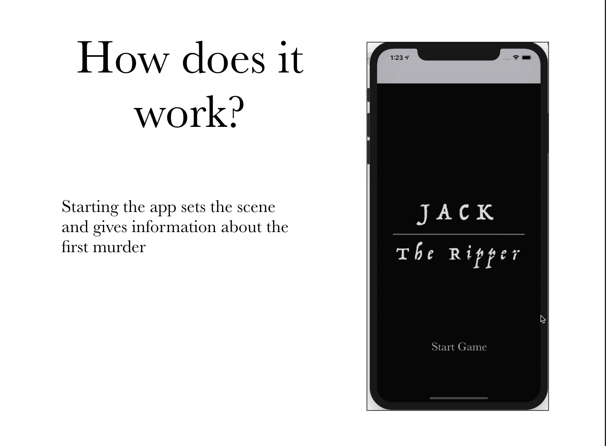
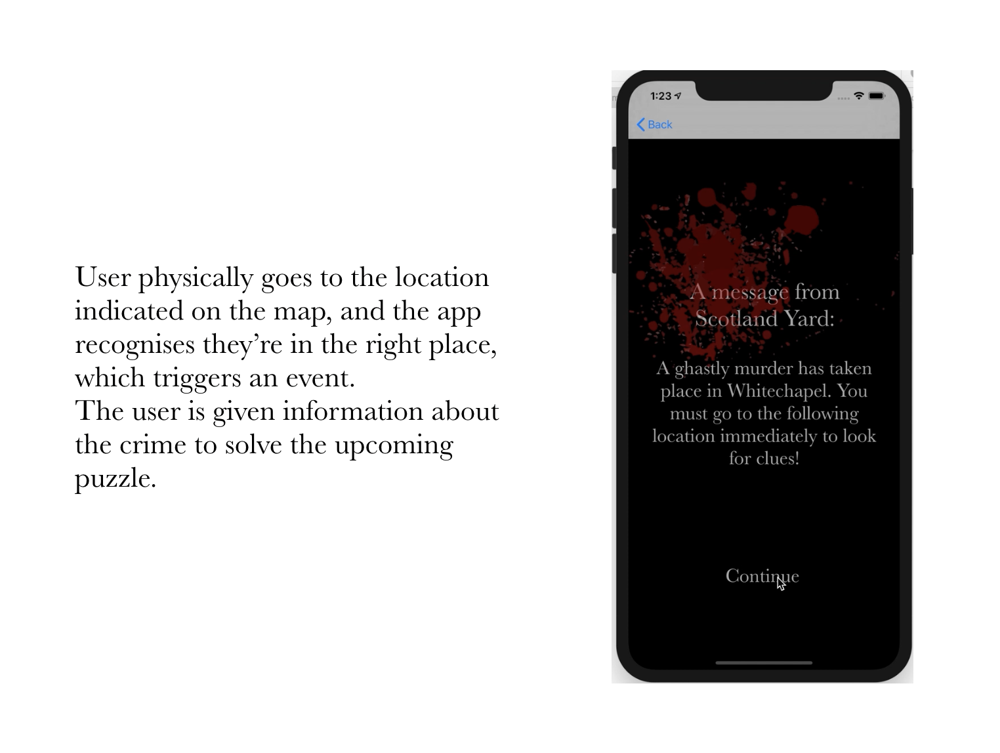
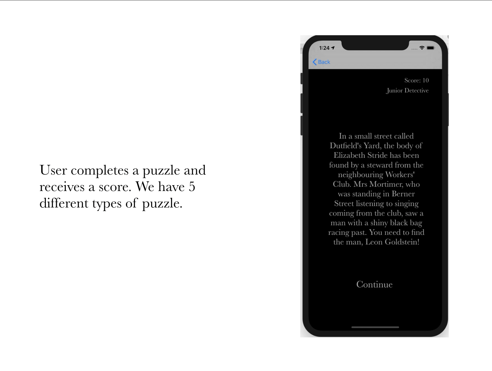
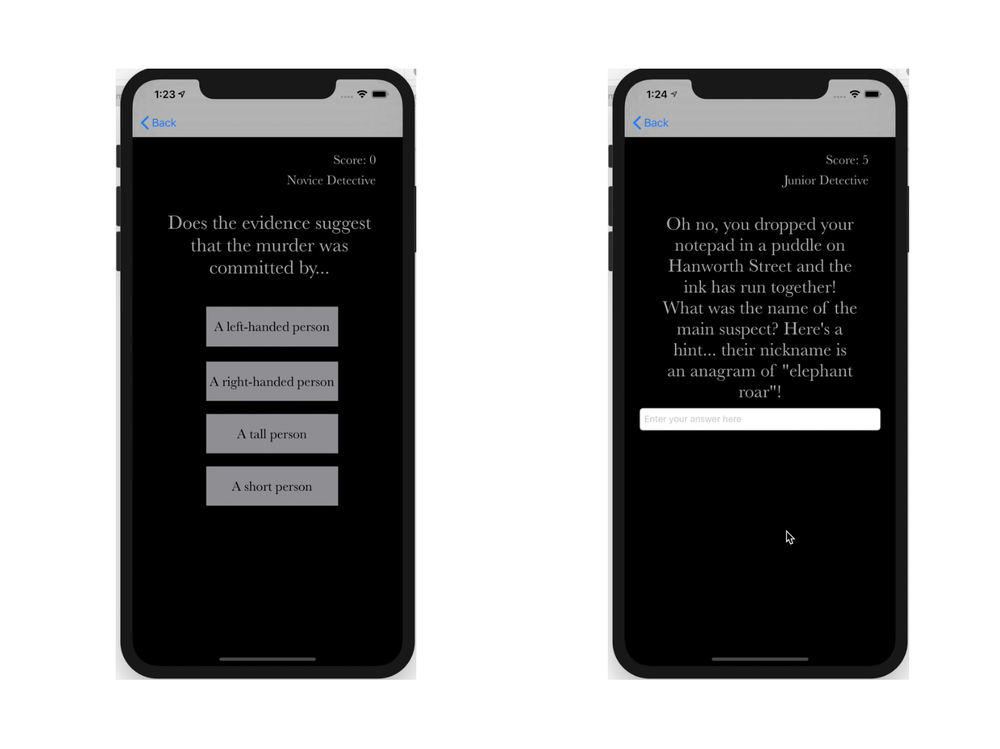
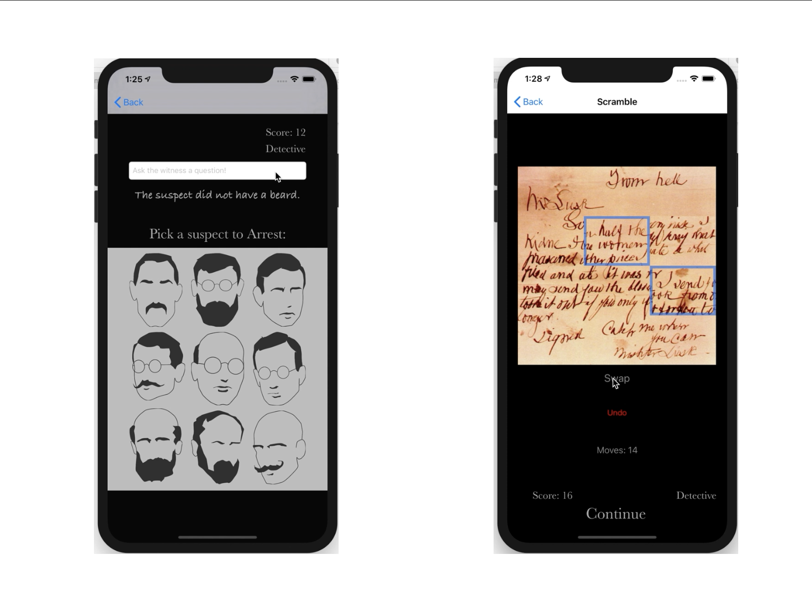
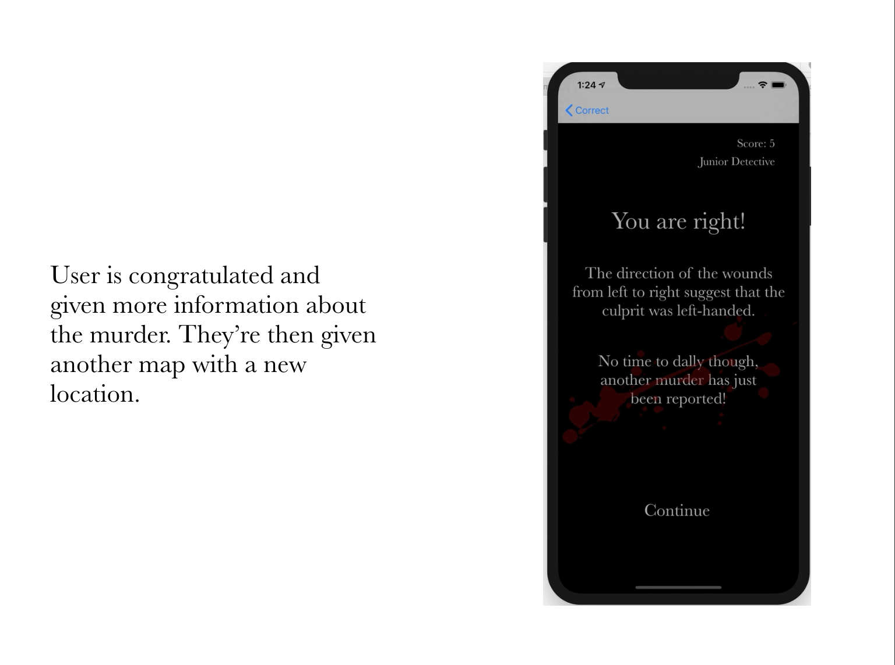
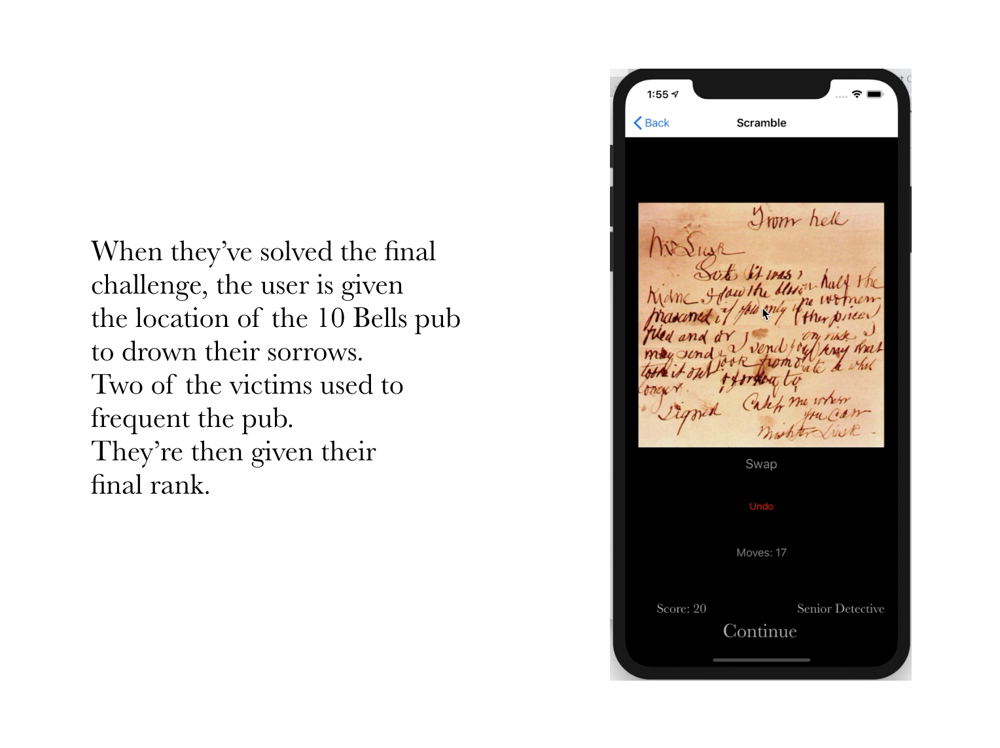

[](https://travis-ci.com/robertamangiapane/Team-6-Game)
<h1 align="center">🔎 Team6 🕵️‍♀️ 🕵</h1>  

<p align="center">
  <a href="#Team6-Authors">Team6</a> •
  <a href="#card-wall">Card Wall</a> •
  <a href="#team-blog">Team Blog</a> •
  <a href="#quickstart">Quickstart</a> •
  <a href="#technologies-used">Technologies Used</a> •
  <a href="#how-it-works">How it Works</a> •
   <a href="#personal-reflection">Personal Reflections</a>
</p>

📝 A team based project to create an iOS Detective App in less than two weeks, all with no prior experience coding in Xcode & Swift. We hope you enjoy a challenge as much as us; you're going to need all your problem solving skills to become a Master Detective!

## Team6 Authors
❇️ [Alec Walker](https://github.com/AlecDWalker)  
❇️ [Danielle Inkster](https://github.com/DanielleInkster)  
❇️ [Heli Sivunen](https://github.com/PacificRebel)  
❇️ [Jay Issuree](https://github.com/JayIssuree)  
❇️ [Josh Davies](https://github.com/JoshDavies)    
❇️ [Roberta Mangiapane](https://github.com/robertamangiapane)


## Card Wall:
🗂 Our team ticketing system helped us to collaborate and organise teamwork.  
Using Trello to share out tasks, track progress and estimate sprints.  
https://trello.com/b/oH5M5yBU/jack-the-ripper-game

## Team Blog:
📖 Read about our journey day by day:   
https://medium.com/team-6

## Quickstart
⚡️Download 'Xcode' from Apples's AppStore (requires MacOS - It's a large file, so go make a coffee!)  

⚡️ Clone this repository to your local terminal, then:
```bash
# From /Team-6-Game repository:
> cd JackTheRipper
# Launch Xcode:
> xed .
```
⚡️ Run tests using key shortcut '⌘cmd' + 'u'  
⚡️ Click the '▻' Play button (Top left menu) to launch the app in an iOS simulator.  
⚡️ Enjoy the App!

## Technologies used:
⚙️ Swift v5.1  
⚙️ Xcode v11.2  
⚙️ XCTest framework  
⚙️ Travis CI  

## How it Works
- _Still images from our final presentation_
<div class="imgContainer" float="left">
  1

  2

  <br>
  3

  4

  <br>
  5

  6

  <br>
  7

  </div>
  
## Personal Reflection
I really enjoyed working on this project. It was a great challenge to learn a new language by doing – if a bit overwhelming at times! I learned a lot about the syntax of Swift; the backend is Syntactically similar to JavaScript and I was able to make some parallels between the frontend (Storyboards) and some of the methods found JavaScript libraries, such as React and JQuery. For this project, I contributed a lot to the backend, such as designing the game model and making the score and rank persist throughout the game. I also did some of the frontend work for the first two challenges. This project reaffirmed my knowledge that I am able to pick up a new language quickly and am able to work effectively under pressure. This project was also a great opportunity to put Agile practices in place to improve overall team performance and end-product quality. 

Some of the challenges faced on this project was the steep curve that comes with learning a new language. While this was to be expected, it was frustrating to have any wasted when there was less than two weeks to create a project. After a lot of reading, some very late nights, and a lot of pairing and mobbing, I’m really satisfied with what we were able to achieve. 

If I'd had more time, I would have liked to do more with UI testing. While we were able to test our backend logic fairly thoroughly using XCTest, the UI testing with XCTest is more complex and time-consuming. As time was not on our side for this project, we made a decision as a team to forego it and relied on feature and functional testing as we went along. 

